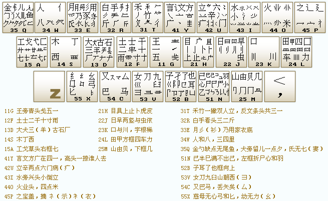

## 字根分区

### 三个层次
1. 笔画：横、竖、撇、捺、折
2. 字根：由笔画组成。汉字的基本单位
3. 单字：由字根组成

### 三个代号
1. 笔画代号：1~5（横、竖、撇、捺、折）
2. 字型代号：1~3（左右型、上下型、杂合型）
3. 区位号：11~55（首笔代号、次笔代号）

### 字根表

## 拆字原则

### 汉字类型
1. “单”结构汉字：一个字根构成的汉字。包括键名汉字和成字字根汉字。例：水、小、力
2. “散”结构汉字：多个字根分散构成的汉字。例：明、佣、监
3. “连”结构汉字：一个单笔画字根与一个基本字根相连构成的汉字。例：自、千、义
4. “交”结构汉字：多个字根交叉构成的汉字。例：内、果、夫

### 拆字规则
1. 书写顺序：根据书写顺序拆分（从左到右、从上到下、从外到内）
2. 取大优先：字根大，字根数少
3. 能连不交：按“连”结构汉字拆
4. 能散不连：按“散”结构汉字拆

### 键面汉字：五笔字根中存在的汉字
1. 键名汉字：键上的第一个字根。输入：按4次字根所在键
2. 成字字根汉字：键上除键名汉字外的汉字。输入：按字根所在键（报户口），根据书写顺序按第一笔、第二笔及最后一笔所在键。不足四码按空格键
3. 基本笔画：横、竖、撇、捺、折。输入：按2次笔画所在键，按2次“L”键

### 键外汉字：五笔字根中不存在的汉字
1. 四个字根的汉字：输入：根据书写顺序依次按四个字根所在键
2. 超过四个字根的汉字：输入：根据书写顺序依次按第一、二、三和最后一个字根所在键
3. 不足四个字根的汉字：输入：根据书写顺序依次按第一、二、三和末笔识别码所在键。不足四码按空格键

### 末笔识别码：末笔代号作为区号，字型代号作为位号

### 注意
1. 汉字已经确定时没必要按末笔识别码所在键
2. 只有两个字根的汉字，按末笔识别码所在键后还要按空格键
3. 大于等于四个字根的汉字不需要按末笔识别码所在键

### 约定
1. 全包围的汉字和偏旁为“辶”、“廴”的汉字，末笔为包围部分的最后一笔。例：回、迼、廷
2. 最后一个字根为“刀”、“力”时，以折作为末笔。例：叨、仇
3. “成”、“我”、“戋”的末笔为撇。例：成、我、贱
